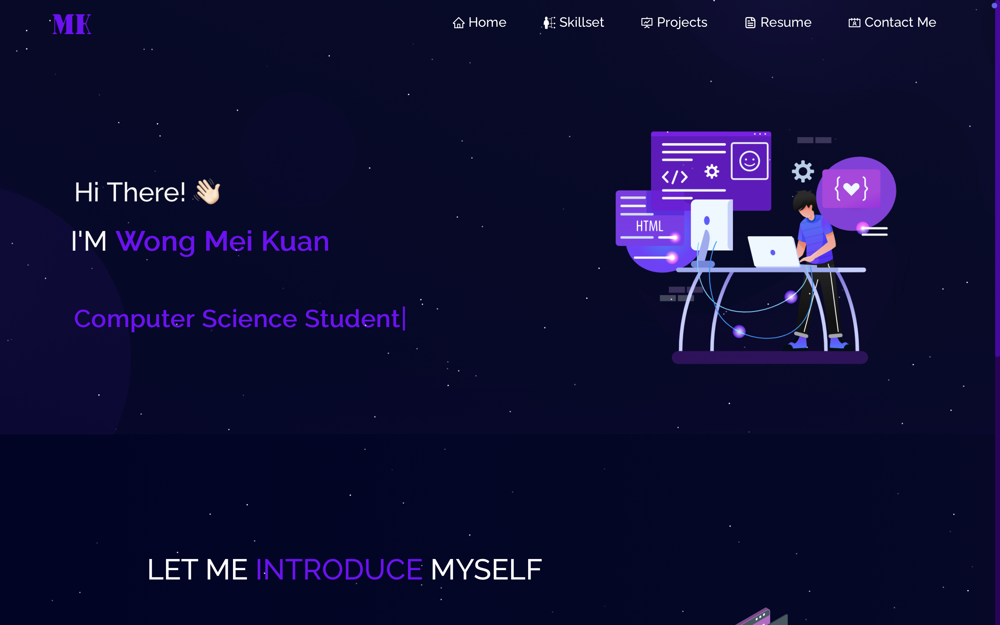

# Personal Portfolio Website

A React-based personal portfolio website showcasing profile information, skills, projects, resume, and contact form.



## Features

- Multi-page portfolio using `react-router-dom`
- Responsive UI with `react-bootstrap`
- Animated particles background and preloader
- Projects gallery with GitHub and demo links
- Resume preview and download
- Contact form integration with EmailJS

## Tech Stack

- React 18
- React Router
- React Bootstrap + Bootstrap 5
- React Icons
- `react-tsparticles`
- `react-pdf`
- EmailJS Browser SDK

## Pages

- `/` - Home + About
- `/skillset` - Skills and tools
- `/project` - Project cards
- `/resume` - Resume preview/download
- `/contact` - Contact form

## Getting Started

### Prerequisites

- Node.js 18+ (recommended)
- npm

### Install

```bash
npm install
```

### Run locally

```bash
npm start
```

App runs at `http://localhost:3000`.

### Build for production

```bash
npm run build
```

## Available Scripts

- `npm start` - Start development server
- `npm run build` - Create production build
- `npm test` - Run tests
- `npm run eject` - Eject from CRA setup

## Project Structure

```text
src/
  components/
    Contact/
    Footer/
    Home/
    Navbar/
    Projects/
    Skillset/
  pages/
    Home.jsx
    Skillset.jsx
    Projects.jsx
    Resume.jsx
    Contact.jsx
  assets/
```

## License

This project is licensed under the [MIT License](LICENSE).

